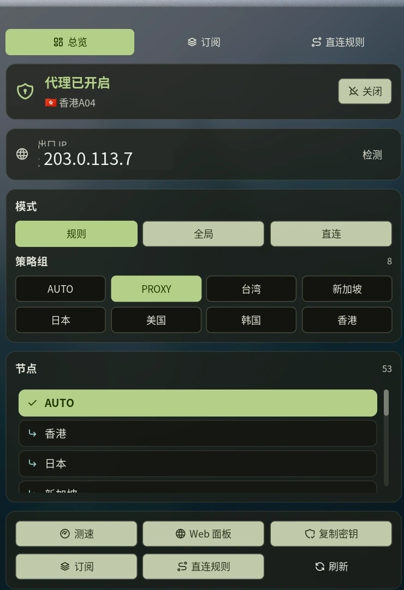

# Mihomo TUN Control

A focused Noctalia plugin for controlling a local, systemd-managed Mihomo TUN
service. It is intentionally narrower than a general Mihomo dashboard: the
main job is to start, stop, inspect, and safely operate the local service.



## Why This Exists

Most Mihomo integrations talk to the external controller and assume the core is
already running. This plugin also owns the local service lifecycle:

- Start, stop, and toggle `mihomo.service` through `systemctl`.
- Read the controller secret from a local file instead of storing it in the
  Noctalia configuration.
- Switch rule, global, and direct modes.
- Browse proxy groups and select nodes.
- Run latency tests and update proxy providers.
- Verify the effective exit IP through the active routing path.
- Copy the controller secret to the clipboard when the dashboard needs it.

The controller logic is also available as a standalone Python CLI.

## Requirements

- Linux with systemd.
- Noctalia v5.1.0 or newer, with plugin API 14 support.
- A running Mihomo external controller.
- Permission to run `systemctl start/stop <unit>`. On system units this usually
  means a matching polkit rule or a deliberately scoped privilege policy.
- A controller secret file readable by the current desktop user.
- Python 3 and `systemctl` on `PATH`.

This plugin does not run `sudo` and does not install a privilege helper.

## Install

For a local Git checkout:

```sh
git clone <repository-url> ~/.local/share/noctalia/plugins/mihomo-tun
noctalia msg plugins source add localdev path ~/.local/share/noctalia/plugins
noctalia msg plugins enable LyraVoid/mihomo-tun
```

Or use the local installer from this repository:

```sh
./tools/install-local.sh
```

If the shell does not load the new entry scripts, restart Noctalia once:

```sh
niri msg action spawn-sh -- \
  'pkill -x noctalia; sleep 2; exec ~/.config/niri/scripts/start-noctalia.sh'
```

## Quick Start

1. Make sure `mihomo.service` is enabled and active.
2. Make sure the controller secret is readable by your desktop user.
3. Add `LyraVoid/mihomo-tun:bar` to the Noctalia bar.
4. Left click the bar widget to toggle the service.
5. Right click the widget to open the control panel.

The panel is floating by default so it inherits Noctalia's normal panel surface,
border, blur, and theme colors.

## Settings

| Key | Default | Description |
| --- | --- | --- |
| `refresh_ms` | `5000` | Lightweight status polling interval. |
| `python_bin` | `python3` | Python interpreter used by the helper. |
| `secret_file` | `/etc/mihomo/.controller-secret` | Local controller secret file. |
| `controller` | `http://127.0.0.1:9090` | Mihomo external controller URL. |
| `unit` | `mihomo.service` | Systemd unit controlled by start/stop. |
| `max_nodes` | `80` | Maximum nodes returned to the panel. |
| `show_label` | `true` | Show the selected node beside the bar glyph. |
| `active_color` | `primary` | Widget color while Mihomo is active. |
| `inactive_color` | `on_surface_variant` | Widget color while Mihomo is stopped. |

## Standalone CLI

The helper can be used without Noctalia:

```sh
python3 scripts/mihomo-ctl.py status
python3 scripts/mihomo-ctl.py toggle
python3 scripts/mihomo-ctl.py group PROXY
python3 scripts/mihomo-ctl.py select PROXY 'node-name'
python3 scripts/mihomo-ctl.py mode global
python3 scripts/mihomo-ctl.py delay PROXY
python3 scripts/mihomo-ctl.py ip
python3 scripts/mihomo-ctl.py secret
```

Every command writes one JSON object to stdout. Failures also return JSON with
`ok: false` and a non-zero exit status.

Environment overrides:

```sh
MIHOMO_CONTROLLER=http://127.0.0.1:9090
MIHOMO_SECRET_FILE=/etc/mihomo/.controller-secret
MIHOMO_UNIT=mihomo.service
MIHOMO_MAX_NODES=80
MIHOMO_API_TIMEOUT=6
MIHOMO_DELAY_URL=https://www.gstatic.com/generate_204
```

## Security Model

- The controller secret is read from a local file. It is never stored in the
  Noctalia plugin settings.
- Every controller request uses `Authorization: Bearer <secret>`.
- The secret is removed from shared plugin state immediately after copying it
  to the clipboard.
- Clipboard managers may retain copied secrets. Clear the clipboard or exclude
  this content from clipboard history if that is a concern.
- Starting and stopping a system service is a privileged operation. Configure
  systemd/polkit narrowly instead of granting broad passwordless access.
- The exit IP check sends requests to the endpoints configured in
  `scripts/mihomo-ctl.py`. Those requests follow the host's active routing and
  proxy rules.

See [SECURITY.md](SECURITY.md) for reporting vulnerabilities.

## Relationship To General Mihomo Dashboards

This project deliberately does not try to replace a broad traffic monitor,
connection inspector, remote-server manager, or full controller UI. Its
differentiator is local systemd/TUN lifecycle control plus secret-file based
authentication. General monitoring and remote controller management are better
served by dedicated Mihomo dashboard plugins.

## Development

```sh
make test
make lint
```

The tests use a fake local controller and never require a real Mihomo secret.
Noctalia itself can additionally lint the plugin:

```sh
noctalia plugins lint .
```

## License

MIT. See [LICENSE](LICENSE).
